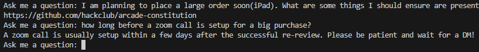

# 🤖 | Hackclub Arcade Help Bot

This project contains a help AI for the hackclub arcade event. It can answer questions which are sent to it and copy the answers to clipboard.

## ⚙️ | Installation

1. **Clone the Repository**

```sh
git clone https://github.com/nik-lmao/hackclub-help-ai.git
cd hackclub-help-ai
```

2. **Create and Activate a Virtual Environment**

```sh
python -m venv .venv
```

- On Windows:
```sh
.venv\Scripts\activate
```

- on macOS and Linux:
```sh
source .venv/bin/activate
```

3. **Install dependencies**

```sh
pip install -r requirements.txt
```

## 🔌 | Usage

1. **Run the script**

```sh
python main.py
```

2. **Ask a question**

Once the script is running, you can type your questions directly into the terminal. The system will provide the best matching answer and copy it to your clipboard.

### If you want to implement your own question and answers, edit the `main.py` file!

## 🖼️ | Screenshot



## ✉️ | Questions

If you have any questions, you can contact me on Discord: @nikitafrfr.

If you came here from the Hackclub Slack, you can reach out to me there as well :)